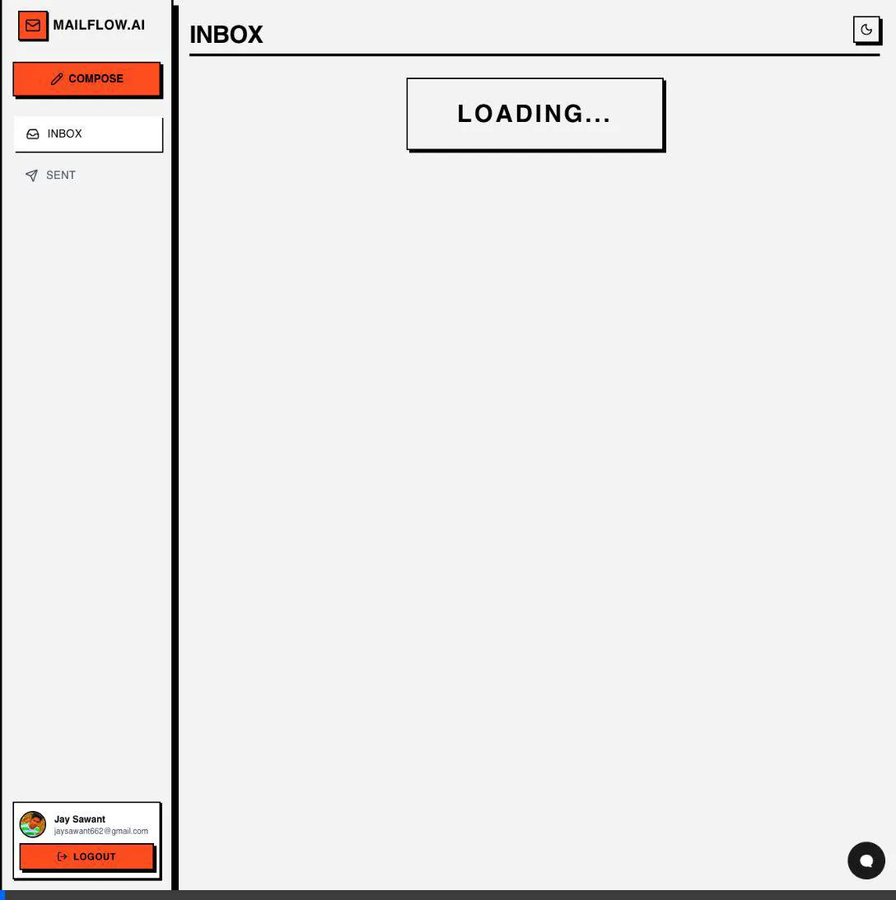
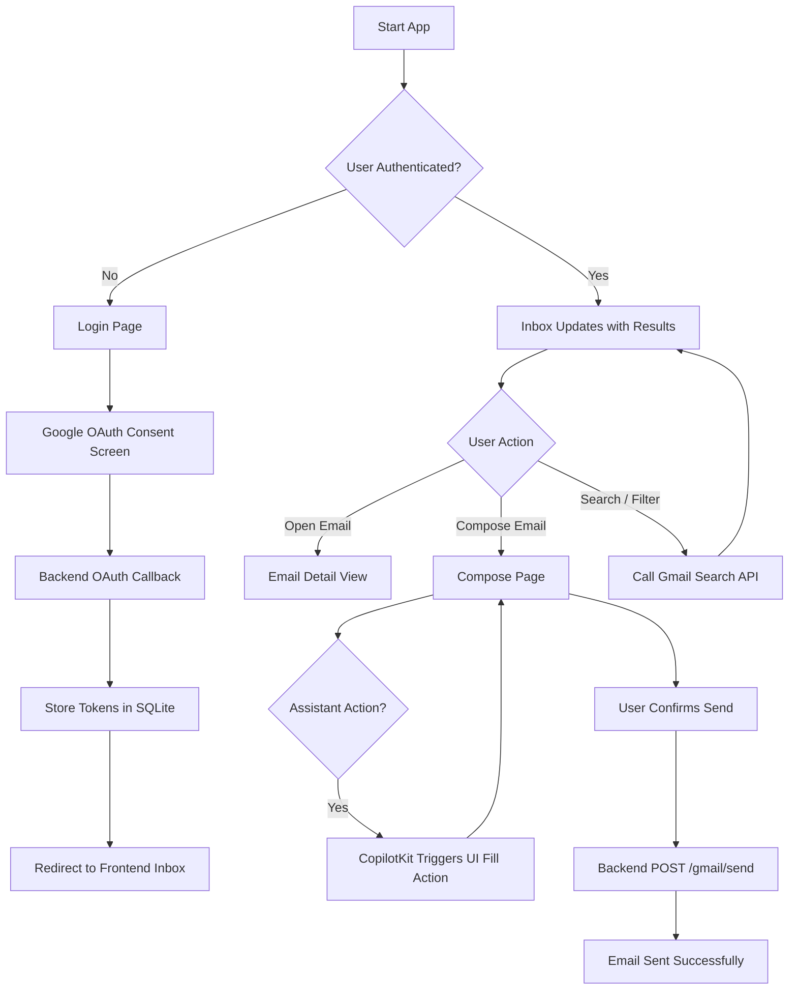
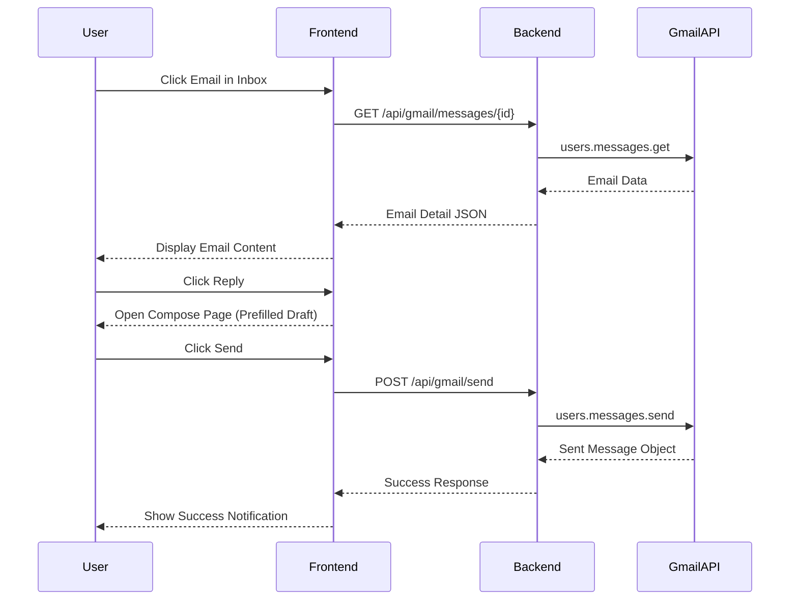
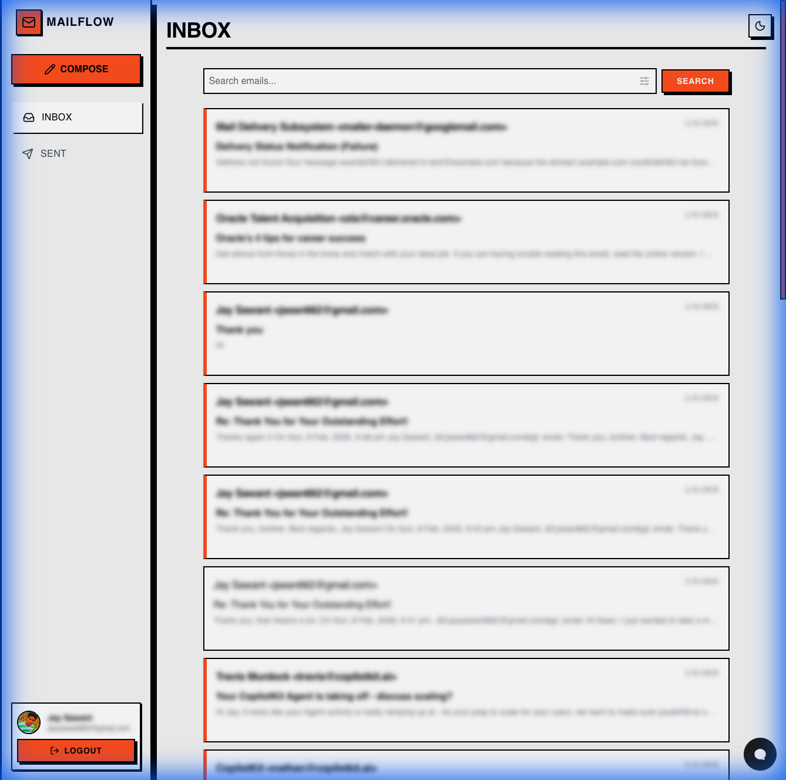
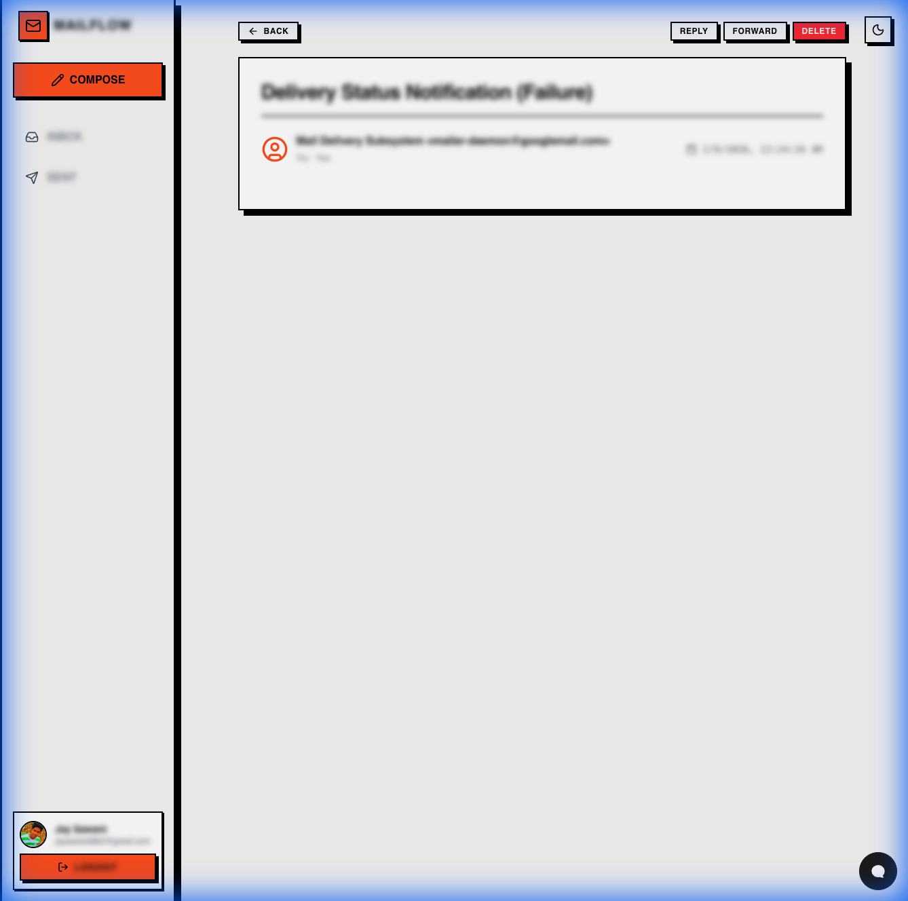

# MailFlowAI

MailFlowAI is a modern, AI-powered email client designed to streamline your inbox experience. It seamlessly integrates with Gmail to provide a unified interface for reading, sending, and managing emails, enhanced with AI capabilities for smarter interactions.

## 🚀 Tech Stack

This project is built using a modern, combined stack to ensure performance, scalability, and a premium user experience.

-   **Frontend**: React, TypeScript, Vite, TailwindCSS
-   **Backend**: Python, FastAPI, Uvicorn
-   **AI & Copilot**: CopilotKit, OpenAI
-   **Database**: SQLite (with SQLAlchemy & Alembic)
-   **Google Integration**: Google Auth, Gmail API
-   **State Management**: Zustand
-   **Styling**: Vanilla CSS (Variables), TailwindCSS (Utility-first)

## ✨ Key Features

-   **Seamless Gmail Integration**: Secure OAuth login and full access to your Gmail inbox and sent folders.
-   **AI-Powered Assistance**: Integrated AI copilot to help draft emails, summarize threads, and answer questions about your inbox.
-   **Modern, Brutalist Design**: A distinct, high-contrast UI with smooth animations and responsive layout.
-   **Email Management**: specific features like Reply, Forward, Delete, and a "Human-in-the-loop" confirmation before sending emails.
-   **Advanced Filtering**: Filter emails by date, attachment presence, and more.
-   **Privacy-Focused**: Critical user data is handled securely, with confirmation steps for sensitive actions.

## 🎥 Demo

Watch MailFlowAI in action, showcasing the AI Copilot and seamless email management.

## 🗺️ User Journeys

### Authentication & Inbox Flow

### Email Interaction Flow

## 📸 Screenshots

### Inbox View
The central hub for your emails, featuring a clean list view, search, and quick filters.

### Email Detail View
A focused view for reading and interacting with individual emails, with options to reply, forward, or delete.

## ⚖️ Trade-offs & Future Improvements

### Current Trade-offs
-   **Local Database Sync**: Currently, we fetch data directly from Gmail for freshness, which might be slower than a fully synced local database for large inboxes.
-   **Polling Strategy**: New emails are detected via periodic polling or refresh on navigation, rather than real-time push notifications (Pub/Sub).
-   **CSS Approach**: A mix of Tailwind and custom CSS variables gives great flexibility but requires discipline to maintain consistency.

### Future Improvements
1.  **Real-time Updates**: Implement Google Cloud Pub/Sub for instant email notifications.
2.  **Offline Mode**: cache emails locally to allow reading and drafting without an internet connection.
3.  **Advanced Search**: Support complex Gmail search queries (e.g., `has:attachment later_than:2d`).
4.  **Multi-Account Support**: Allow users to manage multiple Gmail accounts in a single interface.
5.  **Enhanced AI**: Deeper integration of AI for auto-labeling, smart replies, and calendar scheduling.

## 🛠️ Getting Started

### Prerequisites
-   Python 3.10+
-   Node.js 18+
-   Google Cloud Console Project with Gmail API enabled

### Backend Setup
1.  Navigate to `backend/`.
2.  Create virtual environment: `python -m venv venv`.
3.  Install dependencies: `pip install -r requirements.txt`.
4.  Run server: `uvicorn app.main:app --reload`.

### Frontend Setup
1.  Navigate to `frontend/`.
2.  Install dependencies: `npm install`.
3.  Run dev server: `npm run dev`.

### Access
Open [http://localhost:5173](http://localhost:5173) in your browser.
